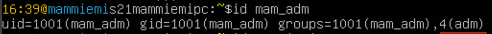
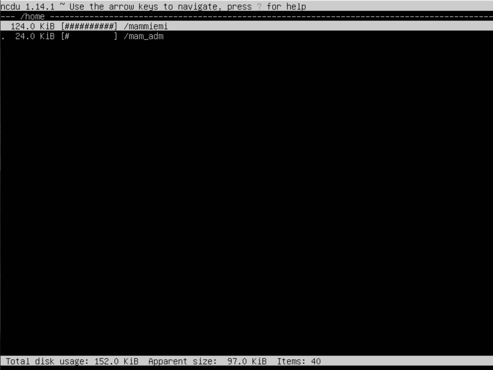

# UNIX/Linux operating systems

## Contents

1 [Installation of the OS](#part-1-installation-of-the-os)  
2 [Creating a user](#part-2-creating-a-user)  
3 [Setting up the OS network](#part-3-setting-up-the-os-network)   
4 [OS Update](#part-4-os-update)  
5 [Using the sudo command](#part-5-using-the-sudo-command)  
6 [Installing and configuring the time service](#part-6-installing-and-configuring-the-time-service)  
7 [Installing and using text editors](#part-7-installing-and-using-text-editors)  
8 [Installing and basic setup of SSHD service](#part-8-installing-and-basic-setup-of-the-sshd-service)  
9 [Installing and using the top, htop utilities](#part-9-installing-and-using-the-top-htop-utilities)   
10 [Using the fdisk utility](#part-10-using-the-fdisk-utility)   
11 [Using the df utility](#part-11-using-the-df-utility)    
12 [Using the du utility](#part-12-using-the-du-utility)    
13 [Installing and using the ncdu utility](#part-13-installing-and-using-the-ncdu-utility)    
14 [Working with system logs](#part-14-working-with-system-logs)     
15 [Using the CRON job scheduler](#part-15-using-the-cron-job-scheduler)

## Part 1. Installation of the OS 

Установлена версия Ubuntu 20.04 Server LTS без графического интерфейса.
Вызов команды __cat /etc/essue__

## Part 2. Creating a user

1. Создать пользователя. Команда для создания пользователя:

        $sudo adduser <user_name>

2. Для добавления пользователя в группу используется комнада:

        $sudo usermod -a -G <group> <user_name>

5. Вывод команды 
        $ cat /etc/passwd

4. В каких группах состоит пользователь показывает команда:

        $id <user_name>

## Part 3. Setting up the OS network
1. Узнаем текущее название машины следующей командой: 

        $hostnamectl

2. Чтобы изменить имя пользователя воспользуемся командой:

        $sudo hostnamectl set-hostname <new_name> 

3. Текущий часовой пояс можно просмотреть командой:

        $timedatectl
    

4. Изменение часового пояса:

        $sudo timedatectl set-timezone Europe/Moscow

5. Сетевые интерфейсы выводятся командой 

        $ip link show

__loopback__ - это официальный стандарт, неотъемлемая часть _unix/linux_ системы, не важно, серверной или настольной. нужен для работы многих приложений, для тестирования итд.
Интерфейс __lo__ - интерфейс обратной петли и позволяет компьютеру обращатся к самому себе. Интерфейс имеет ip-адрес 127.0.0.1 и необходим для нормальной работы системы.

6. Чтобы получить IP адрес устройства от DHPC сервера:
    
На скриншоте ниже видно, что IP интерфейсу присвоен динамически, т.к. в выводе присутствует аббр. _DHCP_:

     $ip r

Соответственно если в выводе данная аббр. отсутствует — это будет означать, что _IP_ статический. Данный метод проверки подойдет особенно тогда, когда подключение к компьютеру производится удаленно, т.к. действие осуществляется из командной строки. 

Используя консольную команду получить _IP_ адрес устройства, на котором вы работаете, от _DHCP_ сервера.

7. Bнутренний _IP_-адрес шлюза, он же _ip_-адрес по умолчанию (gw):

        $routel | grep default
    Его также можно узанть командой "__ip r__" но сейчас используем команду которая укажет только то, что нужно:

8. внешний _ip_-адрес шлюза:

       $wget -qO- ipinfi.io/ip

9. Задание статичных данных:

        $sudo vim /etc/netplan/00-installer-config.yaml

10. после изменений пропингуем удаленные хосты _1.1.1.1_ и _ya.ru_:

        $ping <address>

флаг "_-c_" позволит указать точное количество отправленных пакетов.

## Part 4. OS Update

    $sudo apt-get update
    $sudo apt-get dist-upgrade

Для обновления всех установленных пакетов используется команда _apt-get_ upgrade. Она позволяет обновить те и только те установленные пакеты, для которых в репозиториях, перечисленных в _/etc/apt/sources.list_, имеются новые версии; при этом из системы не будут удалены никакие другие пакеты.

## Part 5. Using the **sudo** command

Команда ___sudo___ _(substitute user and do, подменить пользователя и выполнить)_ позволяет строго определенным пользователям выполнять указанные программы с административными привилегиями без ввода пароля суперпользователя root. Если быть точнее, то команда _sudo_ позволяет выполнять программы от имени любого пользователя, но, если идентификатор или имя этого пользователя не указаны, то предполагается выполнение от имени суперпользователя root. Таким образом, использование _sudo_ позволяет выполнять привилегированные команды обычным пользователям без необходимости ввода пароля суперпользователя _root_ . Список пользователей и перечень их прав по отношению к ресурсам системы может быть настроен оптимальным образом для обеспечения комфортной и безопасной работы. Например, команда sudo в _Ubuntu Linux_, используется в режиме, позволяющем

    $sudo usermod -aG sudo testuser

С помощью команды _id_ убедимя в каких группах состоит пользователь

C помощью команды следующей команды перейдем на аккаунт пользователя _user_bot_1_:

    $su "user_name"

На картинке выше с помозью команды hostnamectl видим что текущее имя хоста "_my-machine-1_".
Изменим hostname c помощью 
        
        $ sudo hostnamectl set-hostname <new-name> 

Успешное изменение именя _localhost_ свидетельствует о том что пользователю  _user_bot_1_ были выданы права sudo.

## Part 6. Installing and configuring the time service

    $sudo apt install ntp

Если вам необходимо только синхронизировать время, то утилиты _timesyncd_ вполне хватает для этой простой задачи. Но иногда вам нужен более широкий функционал. Например, вы хотите настроить в своей локальной сети свой собственный сервер времени, чтобы остальные компьютеры сверяли свои часы с ним. В этом случае вам нужна будет служба ntp. А раз вы ее и так поставите, то зачем вам дублирование функционала? В этом случае имеет смысл отключить _timesyncd_ и оставить только _ntp_. Она умеет работать и в качестве сервера времени, и в качестве клиента синхронизации.

    $sudo systemctl enable --now ntp

Проверяем статус синхронизации:

    $timedatectl show

## Part 7. Installing and using text editors

Для скачивания текстовых редакторов используем команду:

    $sudo apt install <program_name>

Созданные файлы:

Чтобы сохранить сделанные изменения, нажмите _Ctrl+O_. Для выхода из nano нажмите _Ctrl+X_. Если вы выходите из редактора, а файл изменен, nano предложит сохранить файл. Чтобы отказаться от сохранения, просто нажмите _N_, а для подтверждения — _Y_. Редактор запросит имя файла. Просто введите имя, а затем нажмите Enter.

Нажмите клавишу _Esc_, это важно, потому что вам необходимо выйти из режима вставки, прежде чем вводить команды выхода. Далее можете вести одну из следующих команд:

* :q - выйти;
* :q! - выйти принудительно;
* :wq - позволяет сохранить и выйти Vim.

В таблицы внизу редактора mcedit указаны основные команды. Сохранение - _F2_, Выход _F10_.

Редактирование без сохранения изменений:

Чтобы выйти не сохраняя изменения следует нажать комбинацию клавиш _Ctrl+X_, затем отказаться от сохранения нажав клавишу _N_.

Нажмите клавишу _Esc_. Далее "_:q!_" - выйти не сохраняя изменения;

Чтобы выйти из _MCEDIT_ нажмите _F10_ затем стрелочками переключитесь на ячейку "_no_", чтобы отказаться от сохранения.

Как видим содержимое файлов дейсвтительно не изменилось.

---

NANO

Чтобы в редакторе nano выполнить поиск и замену текста используется сочетание клавиш "_Ctrl+\\_".

Нажимте _Ctrl+\\_, введите строку, которую необходимо искать и нажмите клавишу Enter. Затем введите строку, на которую произвести замену и нажмите Enter.

После этого появится предложение по замене первого вхождения вашей строки. Вы можете нажать:
_A_ — Выполнить автоматическую замену всех вхождений строки.
_Y_ — Выполнить замену данной найденной строки (после этого вы переместитесь к следующему в хождению искомой строки).
_N_ — Отменить замену данной строки (после этого вы переместитесь к следующему в хождению искомой строки).
_Ctrl+C_ — Прервать поиск.

До:

После: 

 VIM

Общая форма команды замены следующая:

    :[range]s/{pattern}/{string}/[flags] [count]
 

Команда ищет в каждой строке _[range]_ a _{pattern}_ и заменяет ее на _{string}_. _[count]_ — положительное целое число, умножающее команду.

Если нет _[range]_ и _[count]_, заменяется только шаблон, найденный в текущей строке. Текущая строка — это строка, в которой находится курсор.

Например, чтобы найти первое вхождение строки _‘foo’_ в текущей строке и заменить его на _‘bar’_, вы должны использовать:

    :s/foo/bar/
 

Чтобы заменить все вхождения шаблона поиска в текущей строке, добавьте флаг "_g_":

    :s/foo/bar/g
 

Если вы хотите найти и заменить шаблон во всем файле, используйте символ процента _%_ в качестве диапазона. Этот символ указывает диапазон от первой до последней строки файла:

    :%s/foo/bar/g

До:

После:

---

 MCEDIT

В _MCEDIT_ для того чтобы заменить текст сначала следует нажать клавишу _F7_ для поиска нужных строк/паттернов, после чего нажамать клавишу _F4_ для указания параметров замены текста

До:

После:

## Part 8. Installing and basic setup of the **SSHD** service

Обновим репозиторий 

    $sudo apt update

Установим  SSH

    $sudo apt-get install ssh

Установим  OpenSSH

    $sudo apt install openssh-server

Добавим пакет SSH-сервера в автозагрузку:

    $sudo systemctl enable ssh

Открываем порт 2022

    $sudo vim /etc/ssh/sshd_config

Перезагрузим сервис

    $sudo systemctl restart sshd

* _netstat_ - служит для отображения состояния сетевого интрфейса.
* _flag t_ - показать _TCP_ соединения.
* _flag a_ - вывод всех активных подключений _TCP_.
* _flag n_ - для отображения _IP_ адресов вместо имен хостов.
* _Proto_ - имя протокола.
* _Recv-Q_ - данные в буфере приема _TCP/IP_.
* _Send-Q_ - данные в буфере отправки _TCP/IP_.
* _Local Adress_ - локальный _IP_ адрес.
* _Foreign Adress_ - внешний _IP_ адрес.
* _State_ - прослушивается порт или нет.

## Part 9. Installing and using the **top**, **htop** utilities

    $sudo apt-get install top
    $sudo apt-get install htop 

* uptime

* количество авторизованных пользователей

* общую загрузку системы

* общее количество процессов

* загрузку cpu

* загрузку памяти

* pid процесса занимающего больше всего памяти (M)

* pid процесса, занимающего больше всего процессорного времени (T)

* htop отсортированный по PID

* htop отсортированный по PERCENT_CPU

* htop отсортированный по PERCENT_MEM

* htop отсортированный по TIME

## Part 10. Using the **fdisk** utility

    $sudo fdisk -l 

* Device
    * dev
* Size
    * 9.1G
* Sectors
    * 19103744

* Swap
    * 1.7G

## Part 11. Using the **df** utility

    $sudo df /

*  size 
    * 9299276 kilobytes
* space used
    * 5121612 kilobytes
* space avalible
    * 3683688 kilobytes
* percentage used
    * 59%

    $sudo df -Th

* size
    * 8.9 Gigabytes
* space used
    * 4.9 Gigabytes
* space avalible
    * 3.6 Gigabytes
* percentage used
    * 59%
* Type
    * ext4

## Part 12. Using the **du** utility

    $sudo du -shb /home /var/log /var
    $sudo du -sh /home /var/log /var
    $sudo du -sh /var/log/*

## Part 13. Installing and using the **ncdu** utility

    $sudo apt-get install ncdu
    $ncdu /home
    $ncdu /var
    $ncdu /var/log

## Part 14. Working with system logs

    $sudo vim /var/log/dmesg
    $sudo vim /var/log/syslog
    $sudo vim /var/log/auth.log
    $grep LOGIN /var/log/auth.log 
    
* time last login = Aug 7 13:59:47
* Username = mammiemi
* Method = by LOGIN

    
    
    $sudo systemctl restart sshd 
    $sudo cat /var/log/syslog 

## Part 15. Using the **CRON** job scheduler

    $sudo crontab -e 
    $sudo crontab -l 

* [В начало](#contents)
